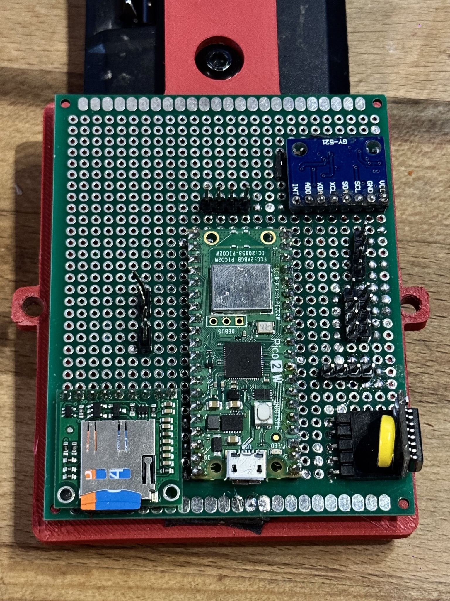

# Sufni Suspension Telemetry - Firmware

Firmware for a [Raspberry Pi Pico W](https://www.raspberrypi.com/products/pico-w/) / [Pico 2 W](https://www.raspberrypi.com/products/pico-2-w/) based mountain bike suspension telemetry data acquisition unit. Records suspension travel, IMU, and GPS data to SD card in a custom binary format (SST) for analysis in companion desktop and mobile applications.

 

## Documentation

- [docs/daq.md](docs/daq.md) — how to build the DAQ hardware: parts list, wiring, and assembly.
- [docs/manual.md](docs/manual.md) — user manual for operating a built DAQ: buttons, calibration, recording, and network server.
- [ARCHITECTURE.md](ARCHITECTURE.md) — firmware internals: state machine, dual-core data pipeline, SST binary format, sensor abstraction, and protocols.

## Getting started

### 1. Clone and initialize submodules

```sh.


git clone https://github.com/sghctoma/sufni-firmware.git
cd sufni-firmware
git submodule update --init --recursive
```

The following libraries are included as git submodules under `external/`:

| Library                                                                                        | Description                                              |
| ---------------------------------------------------------------------------------------------- | -------------------------------------------------------- |
| [no-OS-FatFS-SD-SDIO-SPI-RPi-Pico](https://github.com/carlk3/no-OS-FatFS-SD-SDIO-SPI-RPi-Pico) | FAT filesystem and SD card driver (SPI and SDIO)         |
| [pico-as5600](https://github.com/sghctoma/pico-as5600)                                         | AS5600 magnetic rotary encoder driver                    |
| [pico-ssd1306](https://github.com/sghctoma/pico-ssd1306)                                       | SSD1306 OLED display driver (I2C and SPI)                |
| [lwgps](https://github.com/MoridinBG/lwgps)                                                    | Lightweight GPS parser (forked for Quectel PQTM support) |

### 2. Generate cmake presets

The firmware supports many hardware configurations via cmake cache variables. An interactive Python script generates a `CMakePresets.json` tailored to your specific hardware setup:

```sh
python3 generate_cmake_presets.py
```

The script walks you through the following options:

| Option                          | Choices                                 | Default  |
| ------------------------------- | --------------------------------------- | -------- |
| Board                           | Pico W, Pico 2 W                        | Pico 2 W |
| MicroSD connection              | SPI, SDIO                               | SPI      |
| Display connection              | I2C, SPI                                | I2C      |
| Fork sensor                     | AS5600 (rotational), Linear (ADC)       | AS5600   |
| Shock sensor                    | AS5600 (rotational), Linear (ADC)       | AS5600   |
| GPS module                      | None, LC76G (UART), M8N / BN-880 (UART) | LC76G    |
| Frame IMU                       | None, MPU6050, LSM6DSO                  | MPU6050  |
| Fork IMU                        | None, MPU6050, LSM6DSO                  | LSM6DSO  |
| Rear IMU                        | None, MPU6050, LSM6DSO                  | None     |
| IMU protocol (LSM6DSO only)     | I2C, SPI                                | I2C      |
| Log to file (debug builds only) | Off, On                                 | Off      |

The script generates two presets: a **Release** build and a **Debug** build. The Debug preset enables USB serial output (`USB_UART_DEBUG`) and optionally file logging. Preset names are derived from the selected options (e.g. `pico2-spi-i2c-f_as5600-s_as5600-fr_mpu6050-fo_lsm6dso-gps_lc76g-release`).

See [ARCHITECTURE.md](ARCHITECTURE.md) for the full table of build variables, the state machine, SST binary format specification, data pipeline, sensor abstraction, calibration system, and hardware interfaces.

### 3. Build

There are two ways to build: using the VS Code Raspberry Pi Pico extension, or from the command line.

#### VS Code with the Raspberry Pi Pico extension

1. Install the [Raspberry Pi Pico](https://marketplace.visualstudio.com/items?itemName=raspberry-pi.raspberry-pi-pico) extension for VS Code. It automatically downloads and manages the Pico SDK, toolchain, CMake, Ninja, and picotool.

2. Open this project folder in VS Code. The extension will offer to import it as a Pico project -- accept the prompt. This configures the build environment and IntelliSense automatically.

3. Select a cmake preset (generated in step 2) when prompted, or via the CMake status bar.

4. Build with the toolbar build button or `Ctrl+Shift+B` / `Cmd+Shift+B` and CMake: build or from the Pico extension in vs code .

For a detailed walkthrough, see the official [Getting Started with the Pico extension](https://datasheets.raspberrypi.com/pico/getting-started-with-pico.pdf) guide.

#### Command line

Requires the [Arm GNU Toolchain](https://developer.arm.com/downloads/-/arm-gnu-toolchain-downloads), CMake (>= 3.21), and Ninja or Make. Set `PICO_SDK_PATH` and `PICO_EXTRAS_PATH` to the locations of the [Pico SDK](https://github.com/raspberrypi/pico-sdk) and [Pico Extras](https://github.com/raspberrypi/pico-extras) on your system.

```sh
# Configure (use the preset name printed by the script)
cmake --preset <preset-name>

# Build
cmake --build build/<preset-name>
```

The output is a `sufni-suspension-telemetry.uf2` file in the build directory.

## Flashing

### BOOTSEL (drag and drop)

1. Hold the BOOTSEL button on the Pico and plug it in via USB. It mounts as a USB mass storage device.
2. Copy the `.uf2` file to the mounted drive. The Pico reboots and runs the firmware automatically.

### picotool

With [picotool](https://github.com/raspberrypi/picotool) installed:

```sh
# Force the Pico into BOOTSEL mode over USB, then load and reboot
picotool load build/<preset-name>/sufni-suspension-telemetry.uf2 -f
```

If the Pico is already in BOOTSEL mode, omit the `-f` flag.

## Configuration

The device reads a `CONFIG` file from the SD card at boot. It is a plain-text `key=value` file (one entry per line). Missing keys use built-in defaults. The file can be edited manually on the SD card or uploaded remotely via the management protocol.

### WiFi modes

The device can operate in either **STA** (station) or **AP** (access point) mode, selected by the `WIFI_MODE` key:

- **STA mode** — the device joins an existing WiFi network using `STA_SSID` / `STA_PSK`. Use this when the trailhead, garage, or workshop has WiFi coverage and you want the device on the same LAN as your phone or laptop. NTP time sync requires an internet-connected network in this mode.
- **AP mode** — the device creates its own WiFi network using `AP_SSID` / `AP_PSK` and runs a built-in DHCP server. Clients connect directly to the device. Use this in the field where no infrastructure WiFi is available. NTP sync is skipped; time falls back to the on-board DS3231 RTC.

The TCP server (port 1557, mDNS service `_gosst._tcp`) and management protocol work identically in both modes — the choice is purely a link-layer one. The mDNS TXT record advertises a `bid=<hex>` board ID so multiple devices can be distinguished on the same network.

In general, only a single client can connect to the device.

### CONFIG keys

| Key                  | Default          | Description                                                                 |
| -------------------- | ---------------- | --------------------------------------------------------------------------- |
| `WIFI_MODE`          | `STA`            | `STA` (join existing network) or `AP` (create access point)                 |
| `STA_SSID`           | `sst`            | SSID for station mode (also accepted as `SSID`)                             |
| `STA_PSK`            | `changemeplease` | Password for station mode (also accepted as `PSK`)                          |
| `AP_SSID`            | `SufniDAQ`       | SSID when in AP mode                                                        |
| `AP_PSK`             | `changemeplease` | Password when in AP mode (minimum 8 characters)                             |
| `NTP_SERVER`         | `pool.ntp.org`   | NTP server hostname for time sync (STA mode only)                           |
| `COUNTRY`            | `HU`             | 2-letter country code for WiFi regulatory domain                            |
| `TIMEZONE`           | `UTC0`           | POSIX TZ string, or a timezone name resolved via `zones.csv` on the SD card |
| `TRAVEL_SAMPLE_RATE` | `200`            | Travel sensor sampling rate in Hz                                           |
| `IMU_SAMPLE_RATE`    | `200`            | IMU sampling rate in Hz                                                     |
| `GPS_SAMPLE_RATE`    | `1`              | GPS fix output rate in Hz                                                   |

In STA mode both `STA_SSID` and `STA_PSK` must be non-empty; in AP mode `AP_SSID` must be non-empty and `AP_PSK` at least 8 characters. If validation fails the `CONFIG` file is rejected and built-in defaults are used. See [ARCHITECTURE.md](ARCHITECTURE.md) for field sizes and additional rules.

## Test utilities

- `tools/inspect_sst_data.py`: Parses an SST file and prints chunk summary (types, counts, record counts, sample rates).
- `tools/sst_to_gpx.py`: Extracts GPS chunks from an SST file and generates a GPX track file with Garmin and custom SST extensions.
- `tools/render_display.py`: Renders mockups of the 128x64 OLED screens for quick UI checks.

## License

MIT
