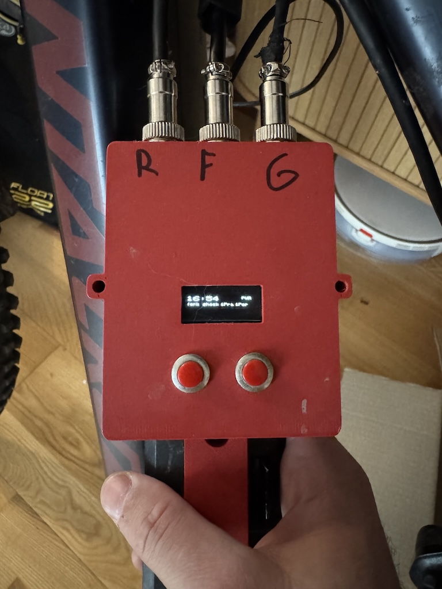
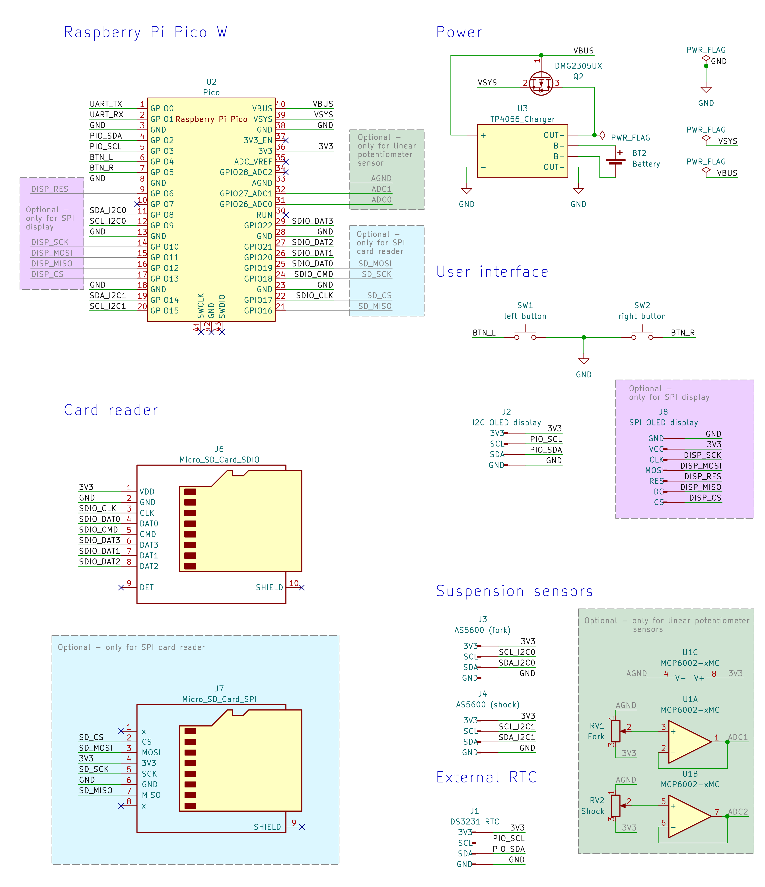
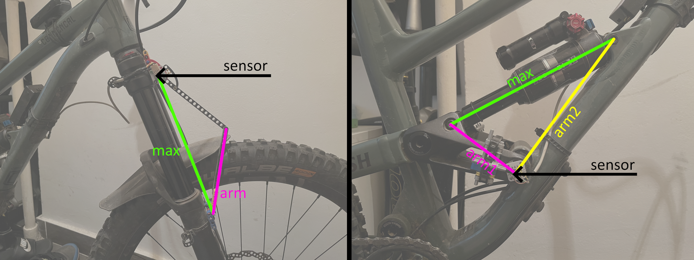

Intro
=====

The DAQ unit collects data from the sensors, and stores them on a MicroSD
card.

 

Building the hardware
=====================

Main box
--------

To build the DAQ unit, you will need the following components:

 - Raspberry Pi Pico W
 - SSD1306 OLED display (I2C by default, can be configured for SPI)
 - MicroSD card reader (SDIO by default, can be configured for SPI)
 - DS3231 RTC unit (I2C)
 - A battery charger unit (based on e.g. TP4056)
 - Battery (I'm using a 18350 lithium-ion battery)
 - A P-channel MOSFET (DMG2305UX recommended by Raspberry)
 - Two push buttons
 - One switch (to cut main power)
 - Two connectors (e.g. JWPF) for the sensors (4-pin for AS5600, 3-pin for potentiometer sensors)
 - (only for potentiometer sensors) MCP6002 operation amplifier

The schematic below shows the default PIN arrangement - if you solder everything
together according to it, you won't have to modify the firmware source code in
the next chapter.

The hardware is supposed to to be buildable from off-the-shelf components, so
there's no PCB design included. Maybe there will be such an option in the future,
but for now, you have to figure out the physical wiring for the components,
breakout boards you got.

Sensors
-------

The project was built with the rotational sensors in mind, but both the firmware
and the backend components can handle the more traditional linear potentiometer-based
sensors as well. It is even possible to mix them, e.g. linear sensor on the fork
and AS5600 on the shock.

### Option 1 - AS5600

For the sensors, you will need 2 AS5600 magnetic rotary encoders, and you need
to  connect their I2C pins to the 4-pin connectors. As of yet, there is no design
for universal mounts, so you will need to get creative.

For the fork, you will need 2 equal-length rods connected to

 - each other,
 - one of them to the uppers,
 - the other to the lowers
 
via pivot points. This will form an isosceles triangle, and the AS5600 chip has
to be attached so that it measures one of the equal angles (preferably the one
at the uppers, so the wiring won't bend when the fork moves). You will need the
lenght of the rods and the maximum distance between the upper and lower pivot
point for calibration.

On the shock, there's no need to construct a triangle, we already have one: the
one defined by the two eyelets and a pivot point on the frame. The AS5600 has
to be put at the frame pivot, and you will need all three sides of the triangle
at maximum expansion for calibration.

### Option 2 - Linear potentiometer

These just need to be connected to the Pico's `AGND`, `3V3` output, and the opamp's
pins indicated on the schematic. If you want to change the default design, the ADC
to use can be configured in `~/firmware/src/fw/hardware_config.h`.

**📝 NOTE:**: with linear potentiometers, the sensor indicators on the status screen
will always indicate the presence of sensors, even when they are not connected.
