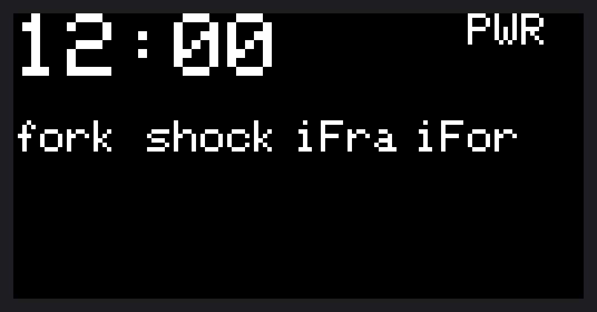
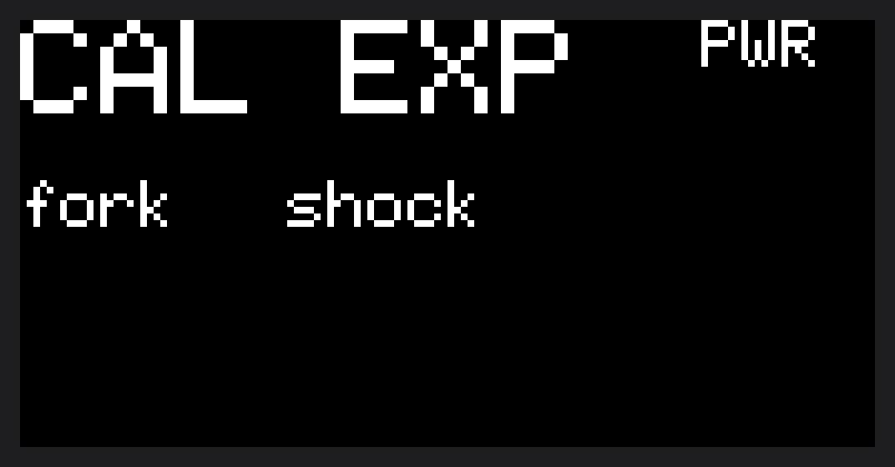
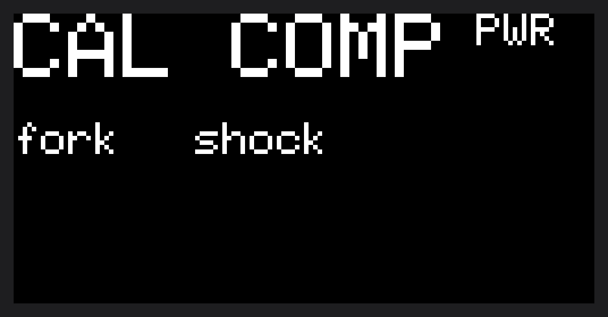
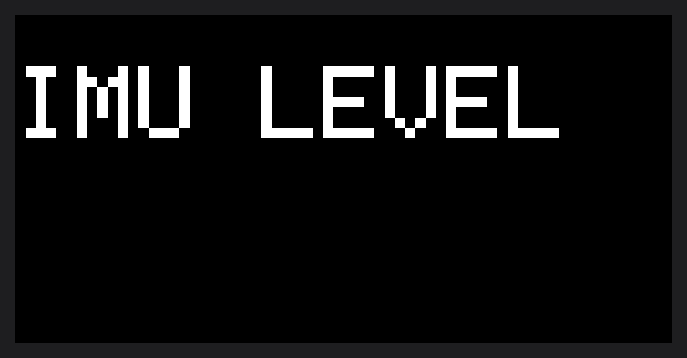
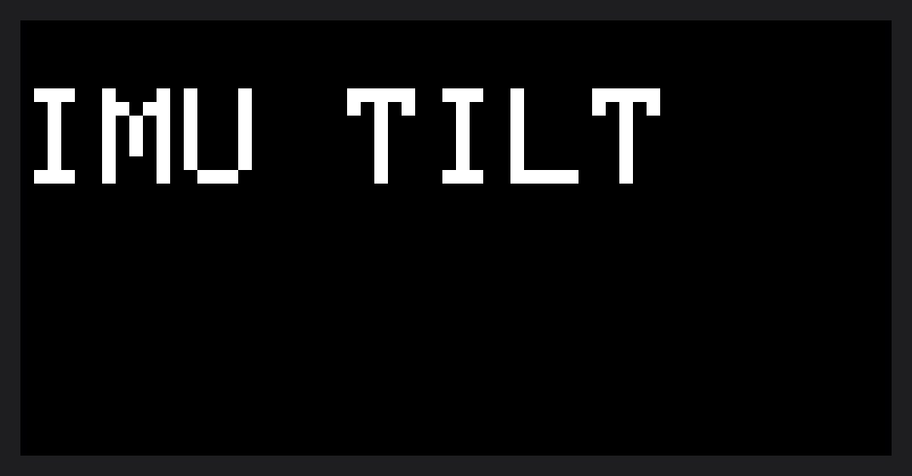
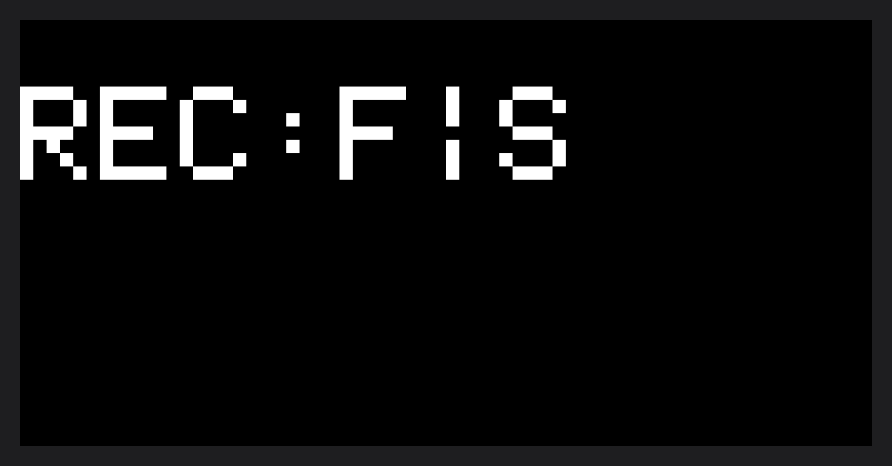
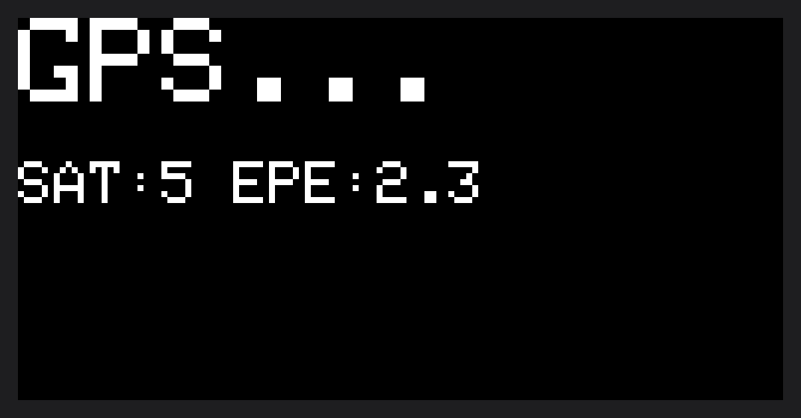
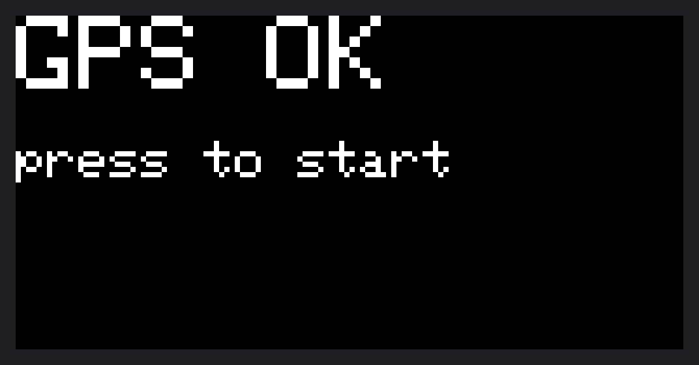
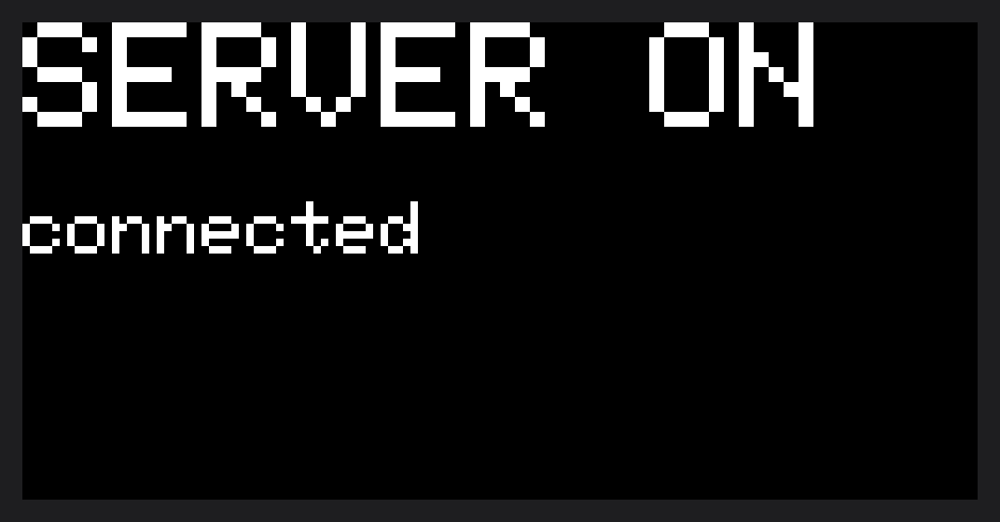

# Sufni Suspension Telemetry - User Manual

This guide describes how to operate the suspension telemetry data acquisition unit (DAQ) day-to-day: what the buttons do, how to calibrate the sensors, how to record a ride, and how to bring up the network so a phone or computer can talk to the device.

## Table of contents

- [The device at a glance](#the-device-at-a-glance)
- [Buttons](#buttons)
- [Powering on and what you see](#powering-on-and-what-you-see)
- [Calibration](#calibration)
  - [When you need to calibrate](#when-you-need-to-calibrate)
  - [Travel calibration](#travel-calibration)
  - [IMU calibration](#imu-calibration)
  - [Re-running calibration later](#re-running-calibration-later)
- [Recording a session](#recording-a-session)
  - [Starting a recording](#starting-a-recording)
  - [Waiting for GPS](#waiting-for-gps)
  - [Placing markers while you ride](#placing-markers-while-you-ride)
  - [Stopping a recording](#stopping-a-recording)
- [Sleep and wake](#sleep-and-wake)
- [Network server](#network-server)
- [USB Mass Storage mode](#usb-mass-storage-mode)

## The device at a glance

The DAQ has:

- A small display.
- Two buttons: **Left** and **Right**.
- A microSD card slot, which holds your recordings, the calibration, and the configuration file.
- A USB port, used both for charging and for plugging the device into a computer.
- Internally, suspension travel sensors (fork and shock), optional IMUs (frame, fork, rear), an optional GPS module, a battery, and a real-time clock.

While idle, the display shows the time, the battery level, and which sensors the firmware can see right now.

## Buttons

The two buttons are context-sensitive. Each can be pressed briefly or held for a long press.

| Action                  | While idle                          | While recording                    | While on the GPS wait screen        | While a server is running                    |
| ----------------------- | ----------------------------------- | ---------------------------------- | ----------------------------------- | -------------------------------------------- |
| **Left, short press**   | Start a recording                   | Stop the recording                 | Before fix: skip GPS and start recording. After fix: confirm and start recording with GPS. | (no effect)                                  |
| **Left, long press**    | (no effect)                         | (no effect)                        | (no effect)                         | (no effect)                                  |
| **Right, short press**  | Put the device to sleep             | Place a marker                     | (no effect)                         | Stop the server and return to idle           |
| **Right, long press**   | Start the network server            | (no effect)                        | (no effect)                         | (no effect)                                  |

When the device is asleep, **any button press wakes it back up** to the idle screen.

In addition, if you hold Left, while booting, the device enters calibration mode.

## Powering on and what you see

When the device boots, it goes to one of three places:

1. **Calibration** - if no calibration has ever been saved, or if you are holding **Left** at boot. The display walks you through the steps described below.
2. **USB Mass Storage** - if the device is connected to a computer over USB at boot. The microSD card appears as a removable drive on your computer. Normal recording and server functions are unavailable in this mode. To leave it, unplug USB and let the device reboot.
3. **Idle** - the normal home screen, showing time, battery, and sensor status.

The idle screen also tells you which sensors are connected. If a sensor you expect is missing, check the wiring before starting a recording. The device polls for sensors continuously while idle, so plugging one in usually shows up on the screen within a second.

## Calibration

Calibration teaches the firmware two things: where the suspension's full extension and full compression are, and how each IMU is mounted on the bike. Without it, travel readings have no reference and IMU data cannot be rotated into bike coordinates.

### When you need to calibrate

You should calibrate:

- **The first time you use the device** (the firmware will force this automatically).
- **After moving or remounting any sensor**, even slightly. Travel sensors are very sensitive to mounting position; IMUs need a fresh orientation reference if their angle on the bike changes.
- **If the readings look wrong** in your analysis app.

To re-trigger calibration on demand, hold the **Left** button while powering the device on. The firmware will start the calibration sequence even if a saved calibration already exists.

### Travel calibration

Travel is calibrated for rotational sensors in a two step process:

1. **Fully extend the suspension.** Lift the bike so the wheels hang free and the fork and shock are at their topped-out position. Press the left button to record the extended position.

   

2. **Compress the suspension.** Push the bike down so all measured susensions compress slightly. Press the left button to record the compressed position.

   

This allows the firmware to determine the zero value for the sensor and in which directions do the values change as the suspension compresses.

After the second step, the device saves the travel calibration and moves on to the IMU steps (if any IMUs are configured).

### IMU calibration

IMU calibration has two physical positions. Do this on a flat, level surface. The bike must stay still during each step.

1. **Bike level on the ground, both wheels down.** Stand the bike upright on level ground. Try not to lean it sideways. Press the left button and wait. The firmware samples each IMU for a couple of seconds to learn its zero point and which way gravity points.

   

2. **Bike on it's rear wheel, front wheel up.** Lift the front of the bike until it rests on the rear wheel, with the frame tilted nose-up (a comfortable wheelie angle). Hold it steady. Press the left button. The firmware uses the change in gravity direction to figure out which way "forward" is for each IMU.

   

After the second step, the device saves the IMU calibration alongside the travel calibration.

### Re-running calibration later

The saved calibration is reapplied automatically when you start a recording or a live preview session, so a freshly reconnected sensor will pick up the latest zero point without rebooting - **as long as a calibration exists for it**. If you swap a sensor for a different unit, or move it on the bike, run the full calibration flow again (hold **Left** at boot).

## Recording a session

### Starting a recording

From the idle screen, **press Left** to start a recording.

What happens next depends on whether GPS is enabled and present:

- **No GPS, or GPS not available**: recording starts immediately. The display switches to the recording screen.

  

  The two characters after `REC:` show which travel sensors are actually streaming to the file: `F` for fork, `S` for shock, and `.` for any sensor that was not detected at recording start.

- **GPS enabled and available**: the device goes to the **GPS wait** screen first.

### Waiting for GPS

When you start a recording with GPS configured and available, the device first goes to the GPS wait screen and tries to acquire a stable position fix. The screen shows the current fix status so you can see progress.

`SAT` is the number of satellites currently in view; `EPE` is the estimated position error in meters. The fix gets more reliable as `SAT` grows and `EPE` shrinks.

The flow from here:

- **If you do not want to wait, press Left.** Recording starts right away, but the GPS module is powered off and no GPS data is written to the file. Use this when you do not need GPS for this ride.
- **If you wait**, the screen will indicate when the fix is ready. Press **Left** to confirm and begin recording with GPS.

  

### Placing markers while you ride

During recording, **press Right** to drop a marker into the file. Markers are useful for splitting the recording into segments later in your analysis app - for example, to mark the start of a particular trail feature. You can drop as many markers as you want. The marker is just a timestamp of a particular moment in time.

### Stopping a recording

**Press Left** to stop. The device flushes the remaining data, closes the file on the SD card, and returns to the idle screen. Each recording is saved as its own file with an incrementing number.

Do not unplug power or remove the SD card while recording. Always stop first.

## Sleep and wake

To save battery while idle, **press Right** from the idle screen. The display turns off and the device enters deep sleep.

To wake it, **press any button**. The display comes back and you return to the idle screen. The clock and saved data are preserved across sleep.

Sleep is only available from the idle screen. You cannot sleep while recording or while a server is running.

## Network server

To communicate with the device from a phone or computer - to download recordings, push a new configuration, set the clock, or watch sensor data in real time - start the network server.

1. From the idle screen, **long-press Right**. The device joins WiFi (or starts its own access point, depending on the configuration file) and brings the server up.

   

   The subtitle reflects what a connected client is doing: `connected` for an idle client, `live` while a live preview session is active, `mgmt` while it is downloading or pushing files. With no client attached the subtitle is omitted.
2. Open the companion app and connect. The device advertises itself on the network, so the app should find it automatically. If you have multiple DAQs nearby, each one shows a unique board ID so you can pick the right one.
3. From the app you can:
   - **List, download, and manage recordings.** Once the app has downloaded and verified a recording, it can mark it as uploaded; the device then moves that file into an `uploaded/` folder on the SD card. You can also trash recordings, which moves them to a `trash/` folder.
   - **Push a new configuration file** or **set the device's clock**.
   - **Watch live sensor data.** The app asks which sensors to stream and at what rate. Readings begin flowing as soon as the session starts. If a sensor is unavailable, the device starts the rest and reports which ones it skipped.
4. To stop the server, **press Right**. The device disconnects from WiFi and returns to the idle screen.

Recording and the network server are mutually exclusive - you cannot start a recording while the server is running, and you cannot bring up the server during a recording. If you want to watch live data while you ride, leave the server running and skip recording for that session.

## USB Mass Storage mode

To access the SD card directly from a computer:

1. With the device powered off, plug it into a computer over USB.
2. Power the device on. It detects the USB connection at boot and enters Mass Storage mode automatically.
3. The SD card appears as a removable drive on the computer. You can copy recordings off, edit the configuration file, manage the calibration file, or update the timezone lookup table.
4. **Eject the drive properly** from the computer before unplugging, just like any USB stick. This prevents file system corruption.
5. Unplug USB. The device reboots into normal operation.

Mass Storage and normal operation are mutually exclusive. The device cannot record or run a server while the SD card is exposed to a computer.
